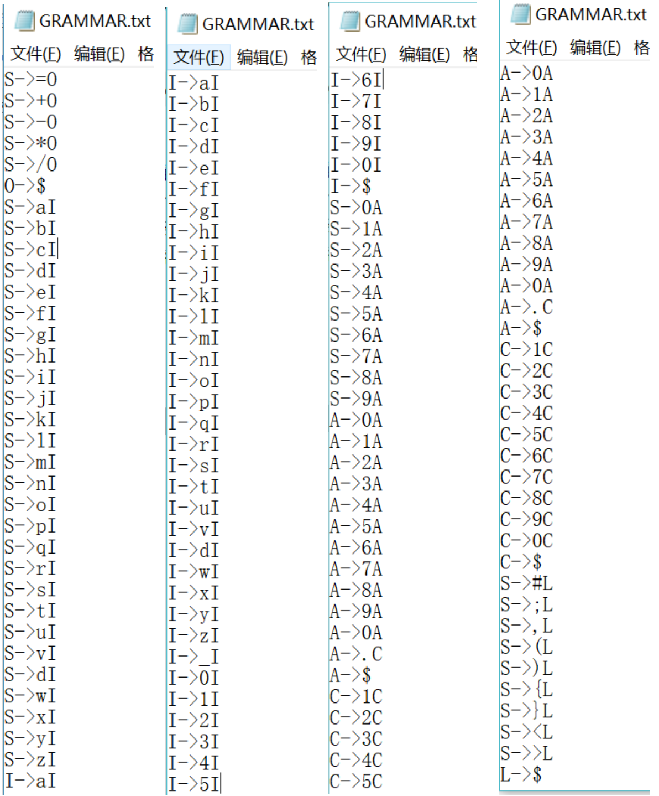
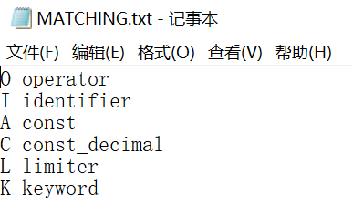
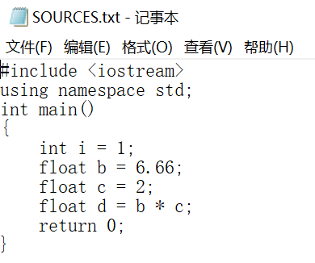
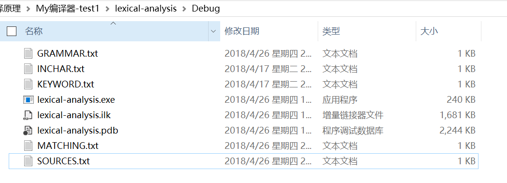
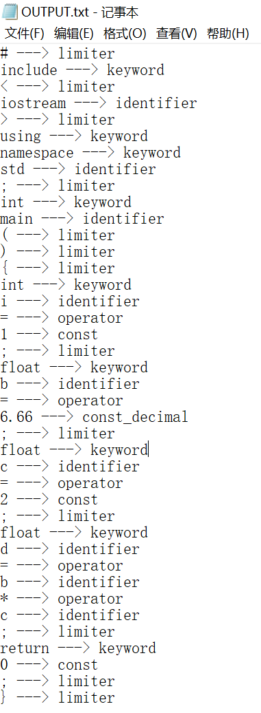
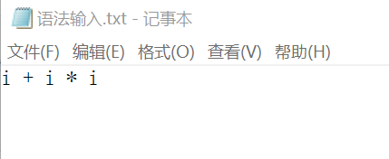
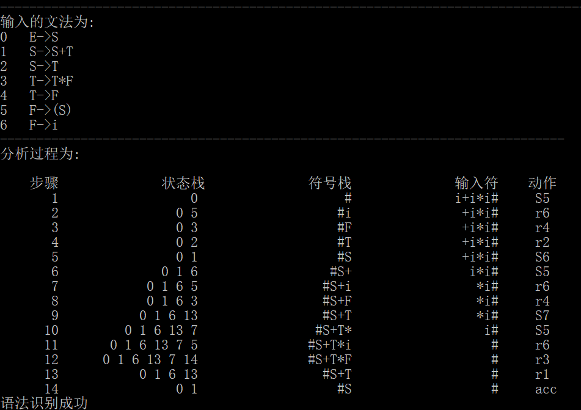

# Lexical-Analyzer And Syntactic-Analyzer （词法分析器和语法分析器）

该项目是基于 **南京理工大学《编译原理》课程作业** 实现的, 非常感谢教学团队的指导！

项目中 [ExecutableFiles](ExecutableFiles) 文件夹内为可执行文件，[SourceFiles](SourceFiles) 文件夹内为源文件。该项目编译环境如下：

## 编译环境

- 使用系统：Windows 10
- 编程语言：C++
- 编程工具：Visual Sudio 2017

## Task 1: Lexical-Analyzer（词法分析器）

### 一、任务

Task 1: Create a lexical analysis program, which supports analyzing regular grammar. 

You  must  use  DFA  (Deterministic  Finite  Automata) or  NFA  (Nondeterministic  Finite  Automata) to implement this program

The inputs of the program are a text document including  a set of productions of 3º grammar (the regular grammar and a source code text document contains a set of strings to be recoganized. The output of the program is a token table which consists of 5 types token: key words identifier const, limiter and operator.    

任务1：创建一个词法分析程序，该程序支持对常规语法的分析。

您必须使用DFA（确定性有限自动机）或NFA（非确定性有限自动机）来实施此程序

程序的输入是一个文本文档，包括一套3º语法的产品（常规语法）和一个源代码文本文档，其中包含一组要重新识别的字符串。 程序的输出是一个由5种类型的令牌组成的令牌表：关键字，标识符，常量，限制符和运算符。

### 二、实现思路

若实现可以识别用户自定义语言的词法分析器，则首先需要识别用户提供的**关键字(key words)**、**标识符(identifier)**、**常数(count)**、**界符(limiter)**、**操作符(operator)**以及**3型文法（3º  grammar）**。其次要根据用户提供的文法构建NFA和DFA。最后将要执行分析的源文件放入DFA中以得到结果。

### 三、设计实现

该词法分析器需要提供5个TXT文件，其内容和作用分别如下：

#### 1. INCHAR.txt

**INCHAR.txt** 中定义了该语言所能输入的字符。注意该语言中所有可以使用的字符都应在 **INCHAR.txt** 中定义。在编译过程中，如果发现未在 **INCHAR.txt** 中定义的字符将会输出“ERROR”并结束。其文件内容如下例：

#### 2. KEYWORD.txt

KEYWORD.txt中定义了该语言的关键字。其文件内容如下例：

#### 3. GRAMMAR.txt

**GRAMMAR.txt** 中定义了该语言的文法，该例中设计了一个三型文法，分别用各个终态表示一类单词。对应关系和描述如下：

|  符号  |  类型  |  备注  |		
| :---: | :---: | :---: |
| O	| 运算符 | 有 = 、+ 、- 、* 、/  5个符号 |
| I	| 标识符 | 以字母开头，后面可以跟字母、数字、下划线 |
| A	| 整型常数 | 整数（如：1 , 22 , 333）|
| C	| 小数型常数 | 小数型常数（如：1.1 , 2.22 , 3.333）|
| L	| 界符 | 有 # 、 ； 、 ， 、 （ 、 ） 、{ 、} 、< 、 > |

备注：关键字KEYWORD保存在KEYWORD.txt中。

其文件内容如下：

#### 4. MATCHING.txt

**MATCHING.txt** 中定义了要将 **GRAMMAR.txt** 中定义的符号匹配成用户自定义的符号，其内容如下例：

其对应关系为：
- O匹配成operator
- I匹配成identifier
- A匹配成const
- C匹配成const_decimal
- L匹配成limiter
- K匹配成keyword

#### 5. SOURCES.txt

**SOURCES.txt** 即用户要进行词法分析的代码段。如下例：

注：EXE文件的目录中一定要有以上五个文件，不然运行会提示未找到XX文件，无法继续分析。其文件目录应如下图所示：

### 四、运行结果

本次示例使用的文件内容均如上截图内容所示，其执行结果为：

分析的结果会保存一份到 *"./OUTPUT.txt"* ，如下图：

## Task 2: Syntactic-Analyzer（语法分析器）

### 一、任务

Task 2: Create a phaser analysis program, which uses LL(1) method or LR(1) method.     

The inputs of the program are a text document including a set of productions of the 2º  grammar (context free grammar) and the token table generated by Task 1.

The output of the  program is YES or NO. i.e., the source code string accords with this 2º grammar or the source  code string doesn’t accord with this 2º  grammar.  

任务2：创建一个使用LL（1）方法或LR（1）方法的语法分析程序。

程序的输入是一个文本文件，包括一套2º语法（上下文无关的语法）产品和任务1生成的令牌表。

程序的输出为是或否。 即符合此2º语法的源代码字符串或不符合此2º语法的源代码字符串。

### 二、实现思路

我选择分析的是 **LR(1)型文法**。

实现思路是根据书本中的**LR(1)**文法实现方法。简单来说就是如下流程：1. 构造LR(1)项目集族 → 2. 构造LR(1)分析表 → 3. 进行LR(1)分析。

### 三、设计实现

该语法分析器需要提供4个TXT文件，其内容和作用分别如下：

#### 1.语法非终结符.txt

该txt内容为用户定义的语法的**语法非终结符**，例如：

#### 2.语法输入.txt

该txt内容为用户定义的语法的**语法输入**，例如：

#### 3.语法文法.txt

该txt内容为用户定义的语法的**语法文法**，例如：

#### 4.语法终结符.txt

该txt内容为用户定义的语法的**语法终结符**，例如：

注：EXE文件的目录中一定要有以上四个文件，不然运行会提示未找到XX文件，无法继续分析。其文件目录应如下图所示：

### 四、运行结果

1. 所输入的**语法文法构造的项目集**如下：

2. 所构造出的**LR(1)分析表**如下：

AnalysisTable.png)

3. 输入的文法和分析过程如下：

最终得到结果——分析成功。

